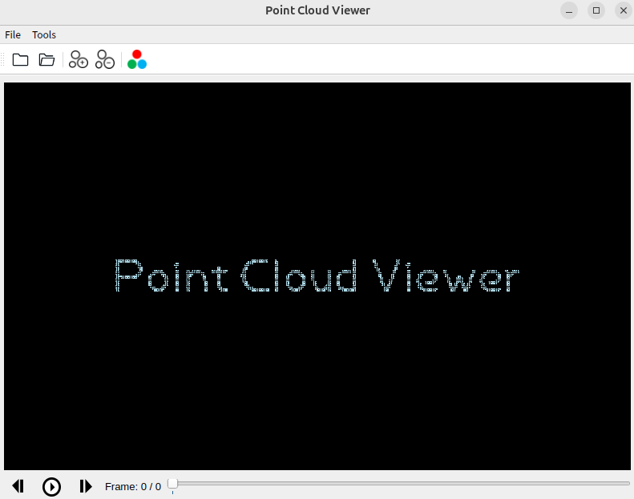

# PCDView

## Build environment

```
pip install -r requirements.txt
```

## Run
```
python qtvis.py
```

## SLAM mapping

1. Open a directory containing an ordered PCD sequence.
2. Click **SLAM 建图** in the toolbar to open the settings panel in the bottom-left of the 3D view and load the pose TXT file.
3. Set the number of historical frames to overlay and optionally enable **历史帧透明显示**, then click **开始建图**. The panel remains available for updating these settings during playback.
   Use **隐藏/显示** in the panel header to collapse or restore the settings without leaving SLAM mode.
4. Use the normal play button to build the map continuously. Click **SLAM 建图** again to exit.

During playback, the transformed origin of every pose is connected into an orange trajectory from the first frame to the current frame.

Pose rows correspond to point-cloud files in natural filename order. Supported row formats are:

```text
x y z roll pitch yaw                 # radians
x y z qx qy qz qw
timestamp x y z qx qy qz qw
r00 r01 r02 tx r10 r11 r12 ty r20 r21 r22 tz
# or a row-major 4x4 matrix (16 values)
```

The pose is interpreted as `world_T_sensor`.




## Package application files
```
sh install.sh
```
